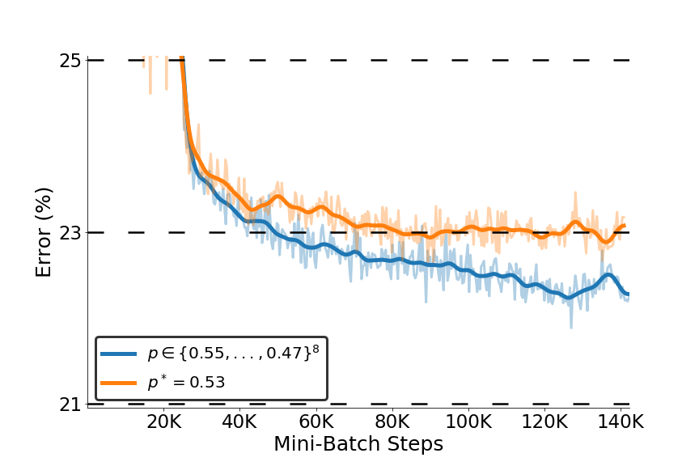
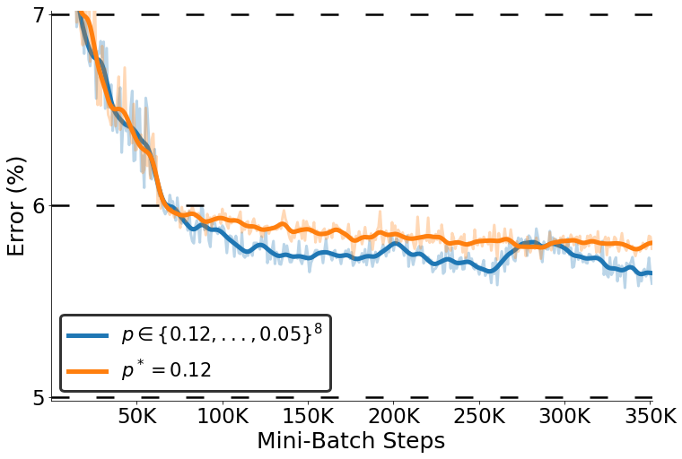
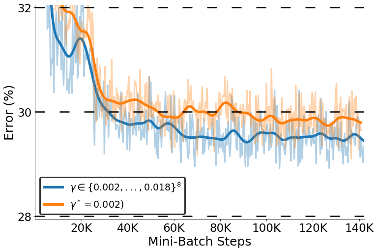
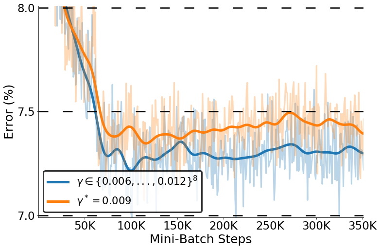
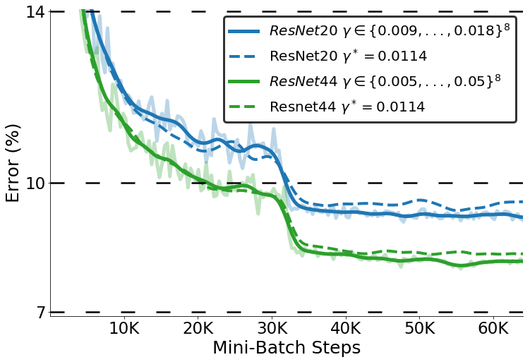
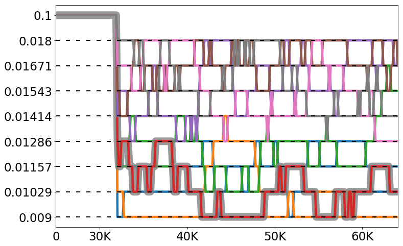

## Reproduction of results from paper

### Instructions
```
git clone https://github.com/vlad-user/parallel-tempering
cd parallel-tempering
cd paper_results
python <<filename>>
```

To reproduce the result just run each individual file. The resulted plots will be generated in subdirectory `plots`.

## Examples:

### Lenet5 | varying dropout vs fixed dropout | CIFAR-10 dataset
```
python lenet5_cifar10_dropout.py

```
<p align="center">
  
</p>

### Lenet5 | varying dropout vs fixed dropout | EMNIST-letters dataset

```
python lenet5_emnist_dropout.py
```
<p align="center">
  
</p>

### Lenet5 | varying learning rate vs fixed learning rate | CIFAR-10 dataset

```
python lenet5_cifar10_learning_rate.py
```

<p align="center">
  
</p>

### Lenet5 | varying learning rate vs fixed learning rate | EMNIST-letters dataset

```
python lenet5_emnist_learning_rate.py
```

<p align="center">
  
</p>


### Resnet20 and Resnet44 | varying learning rate vs fixed learning rate | CIFAR-10 dataset

```
python resnets.py
```

<p align="center">
  
  
</p>
